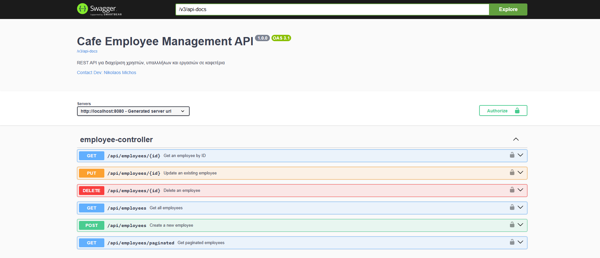

# Employee Management – Backend (Spring Boot)

Ένα RESTful backend για διαχείριση εργαζομένων (employees) με Spring Boot, MySQL και JWT authentication ως **final project για το Coding Factory από το Οικονομικό Πανεπιστήμιο Αθηνών**.

**Σκοπός** του project είναι η **ανάθεση tasks σε κάθε employee** (task assignment & tracking). Στην **πρώτη φάση (MVP)** εστιάζει σε βασική λειτουργικότητα διαχείρισης (CRUD) και authentication· η ανάθεση/διαχείριση tasks θα προστεθεί σε επόμενο milestone.

## 🔧 Τεχνολογίες

* **Java 17**

* **Maven**

* **Spring Boot** (Web, Data JPA, Security)

* **Hibernate**

* **MySQL** (Connector/J)

* **Lombok**

* **JWT Authentication**

* **Frontend:** Angular (σε ξεχωριστό repository — δες παρακάτω)

## 🎯 Σκοπός & Τρέχον MVP

* **Σκοπός**: να αναθέτει tasks σε κάθε employee και να παρακολουθεί την κατάστασή τους.
* **Τρέχον MVP**: βασική διαχείριση εργαζομένων (CRUD), authentication/authorization με JWT, MySQL persistence. Η λειτουργικότητα ανάθεσης/διαχείρισης tasks θα υλοποιηθεί σε επόμενο milestone.

## 📦 Προαπαιτούμενα

* Java 17 (JDK)
* Maven 3.9+ *(ή χρησιμοποίησε το `mvnw`/`mvnw.cmd` του project)*
* MySQL 8+
* (Προαιρετικό) IDE με ενεργοποιημένο **Annotation Processing** για Lombok

## ⚙️ Παραμετροποίηση Περιβάλλοντος

Η εφαρμογή διαβάζει ρυθμίσεις από μεταβλητές περιβάλλοντος (ENV) μέσω του `application.properties`.

### .env (προτεινόμενο)

Δημιούργησε ένα αρχείο `.env` στη ρίζα του project με τιμές όπως:

```env
MYSQL_HOST=localhost
MYSQL_PORT=3306
MYSQL_DB=employeesdb
MYSQL_USER=springuser
MYSQL_PASSWORD=12345

JWT_SECRET=change-me-please
# 24 ώρες σε ms
JWT_EXPIRATION_MS=86400000

# Ενεργό προφίλ (π.χ. dev, test, prod)
SPRING_PROFILES_ACTIVE=test
```

> Φρόντισε το `.env` να είναι στο `.gitignore`.

### Παράδειγμα `application.properties`


```properties
spring.application.name=employee-management

## DB CONNECTION ##
spring.datasource.url=jdbc:mysql://${MYSQL_HOST:localhost}:${MYSQL_PORT:3306}/${MYSQL_DB:employeesdb}?useUnicode=true&characterEncoding=utf-8&useSSL=true&serverTimezone=Europe/Athens
spring.datasource.username=${MYSQL_USER:springuser}
spring.datasource.password=${MYSQL_PASSWORD:12345}

spring.jpa.properties.hibernate.show_sql=true
# Για production προτίμησε validate ή update:
# spring.jpa.hibernate.ddl-auto=update

# Μόνο για τοπικά tests — ΔΗΜΙΟΥΡΓΕΙ/ΔΙΑΓΡΑΦΕΙ σχήμα κάθε εκτέλεση
spring.jpa.hibernate.ddl-auto=create-drop

# Εκτέλεση SQL scripts αφού ετοιμαστεί το schema
spring.jpa.defer-datasource-initialization=true

# UNCOMMENT την 1η φορά για seed και μετά κάν’ το comment
spring.sql.init.mode=always
spring.sql.init.data-locations=classpath:sql/regions.sql
spring.sql.init.encoding=UTF-8
spring.sql.init.platform=mysql

# Ενεργό προφίλ (άλλαξέ το ανάλογα):
spring.profiles.active=${SPRING_PROFILES_ACTIVE:test}

spring.datasource.driverClassName=com.mysql.cj.jdbc.Driver
spring.jpa.properties.hibernate.dialect=org.hibernate.dialect.MySQLDialect
spring.jpa.properties.hibernate.globally_quoted_identifiers=true
spring.data.jpa.repositories.enabled=true

# JWT
jwt.secret=${JWT_SECRET}
jwt.expiration-ms=${JWT_EXPIRATION_MS}
```

### Σημαντικές σημειώσεις ρυθμίσεων

* **`ddl-auto=create-drop`**: κράτησέ το μόνο για γρήγορο τοπικό testing. Για development/production βάλε `update` ή `validate`.
* **`spring.sql.init.mode=always`**: Χρήσιμο για αρχικό seed (π.χ. `regions.sql`). Μετά την πρώτη επιτυχή εκκίνηση, κάν’ το comment για να μην ξανατρέχει κάθε φορά.
* **Time zone**: H JDBC URL ορίζει `serverTimezone=Europe/Athens`.

## 🗄️ Προετοιμασία MySQL

1. Δημιούργησε βάση δεδομένων και χρήστη (αν δεν υπάρχουν):

   ```sql
   CREATE DATABASE IF NOT EXISTS employeesdb CHARACTER SET utf8mb4 COLLATE utf8mb4_unicode_ci;
   CREATE USER IF NOT EXISTS 'springuser'@'%' IDENTIFIED BY '12345';
   GRANT ALL PRIVILEGES ON employeesdb.* TO 'springuser'@'%';
   FLUSH PRIVILEGES;
   ```
2. Προαιρετικό seed: βάλε το `regions.sql` στο `src/main/resources/sql/regions.sql` και άφησε προσωρινά `spring.sql.init.mode=always`.

## ▶️ Εκτέλεση τοπικά (χωρίς πακετάρισμα)

```bash
# με Maven Wrapper (προτείνεται)
./mvnw spring-boot:run
# ή, αν έχεις Maven global
mvn spring-boot:run
```

* Εναλλακτικά μπορείς να ορίσεις runtime προφίλ:

  ```bash
  SPRING_PROFILES_ACTIVE=test ./mvnw spring-boot:run
  ```

## 🏗️ Build & Run ως JAR

```bash
# Καθάρισμα & build (με tests)
./mvnw clean package
# ή χωρίς tests
./mvnw clean package -DskipTests

# Εκτέλεση
java -jar target/employee-management-*.jar --spring.profiles.active=test
```

## 🔌 Local URLs
* Backend Base URL: http://localhost:8080/api
* Swagger UI:       http://localhost:8080/swagger-ui/index.html
* OpenAPI JSON:     http://localhost:8080/v3/api-docs


## 🧪 Tests

* Υπάρχουν **unit tests στο `EmployeeService` με JUnit** (JUnit 5).

Τρέξε όλα τα tests:

```bash
./mvnw test
```

## 🔐 JWT Authentication

### 👤 Προεπιλεγμένος Admin (Seed)

Σε **test** (ή όταν είναι ενεργό το seeding) δημιουργείται προεπιλεγμένος διαχειριστής:

* **Username:** `admin`
* **Password:** `Admin@123`

**Συστάσεις**


* Θέσε τις μεταβλητές `JWT_SECRET` και `JWT_EXPIRATION_MS`.
* Το login endpoint (π.χ. `/auth/login`) επιστρέφει JWT. Χρησιμοποίησέ το σε επόμενα requests με header `Authorization: Bearer <token>`.


## 📚 API Docs (Swagger/OpenAPI)

* **Swagger UI**: διαθέσιμο στο `/swagger-ui/index.html` (όταν είναι ενεργό).
* **OpenAPI JSON**: `/v3/api-docs`.
* Με **JWT**: στο Swagger UI πάτα **Authorize** και βάλε `Bearer <token>` για να καλέσεις secured endpoints.



## 🖥️ Frontend (Angular)

Το frontend υλοποιείται σε **Angular** και βρίσκεται στο **https://github.com/Nikolasama89/cafe-employee-frontend**. Οι πλήρεις οδηγίες εγκατάστασης/εκτέλεσης (Node/Angular CLI versions, περιβάλλοντα, build) βρίσκονται στο **README του frontend**.

**Σύνδεση με backend σε τοπικό dev:**

1. Τρέξε backend στο `http://localhost:8080`.
2. Τρέξε frontend (π.χ. `npm install && ng serve --port 4200`).
3. **CORS**: Είναι ήδη ρυθμισμένα στο backend. Αν αλλάξεις port ή domain στο frontend, ενημέρωσε τα **allowed origins** στην αντίστοιχη config (π.χ. Security config/WebMvcConfigurer).
